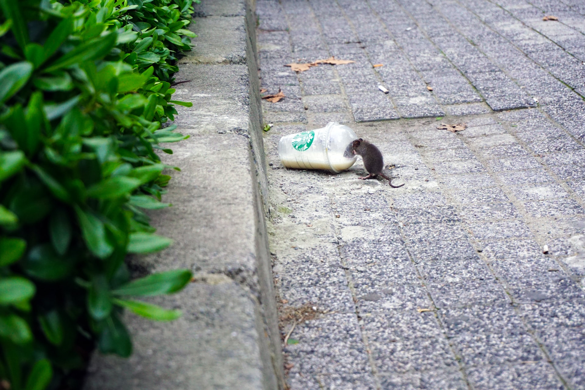
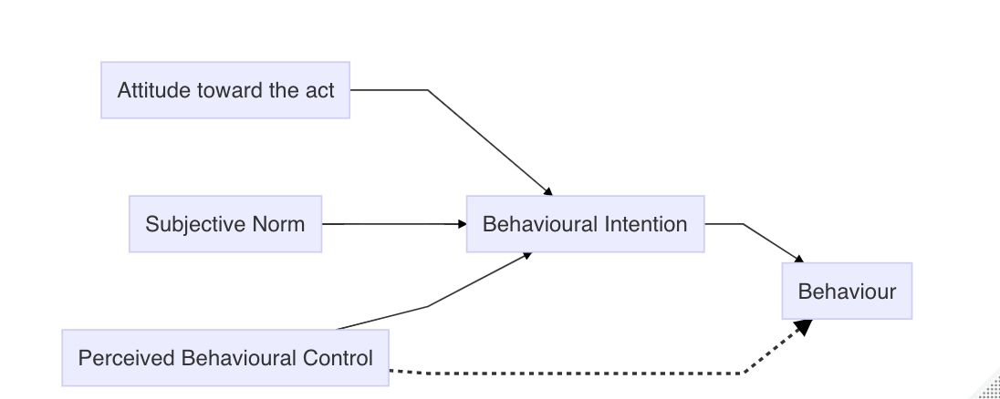
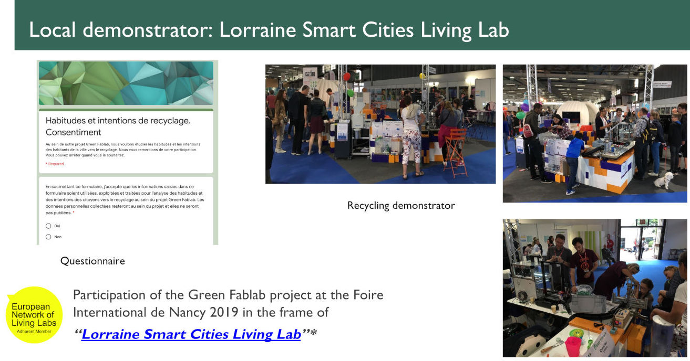
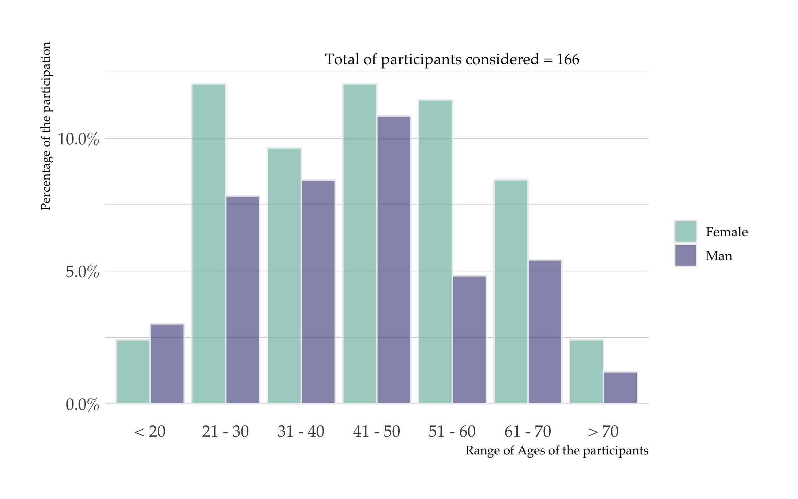
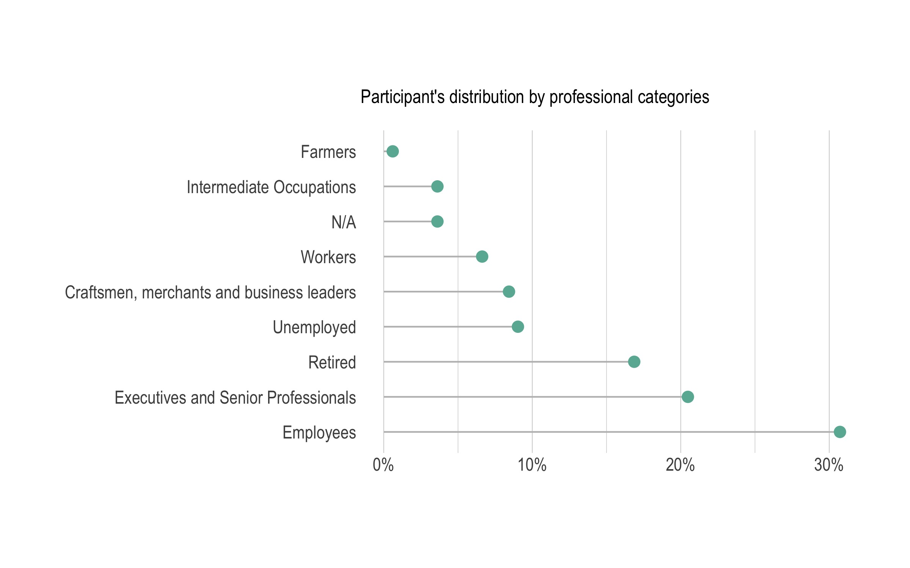

```{r setup, include=FALSE}
knitr::opts_chunk$set(echo = FALSE, message = FALSE, warning = FALSE, include = FALSE)
require(tidyverse)
require(kableExtra)
```


.pull-left[

]

.pull-right[


]


???
- Thank you for being connected and thank you for invitating me in these enginnering conection organized by the University.
- My name is Fabio Cruz. I’m researcher at the University of Lorraine. 

---

class:  center, middle

# The problem

---

# The problem: Plastic waste

.pull-left[ 
- US recycled less than 9% of its plastic waste.
- EU, recycled about 30%. However, this number is what is collected, not from what is in circulation*. 
- China’s ban on plastic trash
- Plastic trash could top 13 billion tons by 2050
- Economics of plastic recycling historically have been challenging
- Little financial incentive to encourage consumers to recycle their own plastic waste

## We barely recycle plastic!!.. 
]


.pull-right[ 

<span class="small">Photo by <a href="https://unsplash.com/@mertguller?utm_source=unsplash&amp;utm_medium=referral&amp;utm_content=creditCopyText">Mert Guller</a> on <a href="https://unsplash.com/s/photos/plastic-waste?utm_source=unsplash&amp;utm_medium=referral&amp;utm_content=creditCopyText">Unsplash</a></span>

]


.footnote[
*Kranzinger, L., Pomberger, R., Schwabl, D., Flachberger, H., Bauer, M., Lehner, M., Hofer, W., 2018. Output-oriented analysis of the wet mechanical processing of polyolefin-rich waste for feedstock recycling. Waste Manag. Res. 36, 445–453
]


---

# Agenda

1. Rational of the research
2. Distributed Recycling via Additive Manufacturing (DRAM)
3. Research questions
4. Framework
5. Case study: Green Fablab
6. Limits & Suggestions

---

# Rationale

.pull-left[

Additive manufacturing is a manufacturing vector in the short future

]
.pull-right[

Innovations Spaces

]

---

# Rationale: Distributed Recycling

.pull-left[ 
Geographical distributed spaces where the polymer recycling process of the surrounding areas will be carried out.

- **Hypothesis:** Plastic recycling by 3D Printing and low cost injection technologies in a local circuit for innovation labs.

Benefits:
- Avoid the use of the environment as a sink for residuals
- Minimize the use of virgin materials


]
.pull-right[ 


.small[See: http://lf2l.fr/projects/green-fablab/]


.tiny[
Cruz Sanchez, F.A., Boudaoud, H., Camargo, M., Pearce, J.M., 2020. Plastic recycling in additive manufacturing: A systematic literature review and opportunities for the circular economy. J. Clean. Prod. 264, 121602. https://doi.org/10.1016/j.jclepro.2020.121602
]
]


---

# Research Question

.pull-left[

In short/long term, 
- Distributed recycling can influence the *intention of recycling*?

- How we can create a local closed loop recycling people use recycled products based on the DRAM ?


]

.pull-right[

.center[]

]


- How can we create 


---

# Theoretical framework


.left-column[

- Theory of Planned Behaviour (TPB)


]

.right-column[

```{r, include=TRUE, echo=FALSE, fig.align='center'}

```
]


---

#  Questionnaire

```{r, include=TRUE}
Variables <- 
tribble(
  ~Construct, ~Variable, ~Indicator,  
  "Socio-economic condition (SEC)", "SEC.1" , "Age",
  "Socio-economic condition (SEC)", "SEC.2" , "Gender",
  "Socio-economic condition (SEC)", "SEC.3" , "Socio-professional category (according to the classification made by the INSEE - French)",

  
  "Attitude towards recycling (ATT)", "AAT.1", "Which of the following elements would encourage you to recycle?",
  "Attitude towards recycling (ATT)", "AAT.2", "In your opinion, have the following elements improved your perception of recycling?",
  "Attitude towards recycling (ATT)", "AAT.3", "Please indicate to what extent you agree with the following sentences",
  
  "Subjective Norm towards recycling (SN)", "SN.1", "Do you think the following elements could improve the perception of recycling in your community?",

  "Perceived Behavioral Control towards recycling  (PCB)", "PCB.1", "Do you think it was easier to make the decision to recycle because of the following factors?",

  "Perceived Behavioral Control towards recycling  (PCB)", "PCB.2", "How far would you be willing to go to use a recycling facility?",
  
 
  "Recycling behavior", "BE.1", "Do you ever recycle some of your household waste?",
  "Recycling behavior", "BE.2", "Why do you recycle?",
  
)

  
Variables %>%
  kable() %>%
  kable_styling(font_size = 17) %>% 
  collapse_rows(columns = 1, valign = "middle")
```


---

# Questionnaire: Foire de Nancy


```{r, include=TRUE,  fig.show="hold", out.width="100%"}

```

- 

---

# Results
## Description of the Population

```{r, include=TRUE,  fig.show="hold", out.width="50%"}



```


---

# Results
## Factors influencing Attitude


---

# Limits


---

# Perspectives


---

class: middle, center

# thanks


