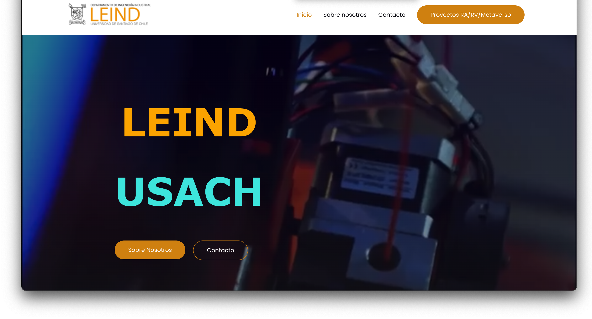

```{r setup, include=FALSE}
# Load packages -----
library(tidyverse)
library(xaringanExtra)
library(xaringanthemer)
library(fontawesome)
library(here)
library(vembedr)
#library(xaringanBuilder)

#source(here("xaringan-themer.R"))

options(htmltools.dir.version = FALSE)
knitr::opts_chunk$set(
  fig.width=9, fig.height=3.5, fig.retina=3,
  out.width = "100%",
  cache = TRUE,
  echo = FALSE,
  message = FALSE, 
  warning = FALSE,
  hiline = TRUE,
  fig.align='center'
)


# Link for the Figures
URL = c('https://raw.githubusercontent.com/fabbiocrux/Figures/main/')


#remotes::install_github("jhelvy/renderthis")


```


class: title-slide, center, bottom

#  `r rmarkdown::metadata$title`

<br>

.pull-left[

```{r, out.width = '80%', fig.align='center'}

                         
                         
```
]

.pull-right[
### `r fa("comment", fill = "steelblue")` `r rmarkdown::metadata$author`
`r rmarkdown::metadata$subtitle` |  `r paste0("Nancy ",  format(Sys.time(), '%d %B, %Y'))`


```{r, out.width="100%", fig.align='center'}
knitr::include_graphics(paste0(URL, 'Logos/UL-ENSGSI-ERPI.svg'))

``` 

]

---

class: middle

# Outline 

1.  .large.bg-yellow[Who I am?]
1.  Lorraine Fab Living Lab
1.  Societal challenges for sustainable manufacturing
1. Approach of Distributed Recycling via Additive Manufacturing (DRAM)
1. Put in reality
1. Some Future considerations

---

```{r Me, child="structure/01-Fabio.Rmd", include=TRUE, eval=TRUE}

```

---

class: middle

# Outline 

1.  Who I am?
1.  .large.bg-yellow[Lorraine Fab Living Lab]
1.  Societal challenges for sustainable manufacturing
1. Approach of Distributed Recycling via Additive Manufacturing (DRAM)
1. Put in reality
1. Some Future considerations


---


```{r LF2L, child="structure/02-LF2L.Rmd", include=TRUE, eval=TRUE}

```


---


class: middle

# Outline 

1.  Who I am?
1.  .large.bg-yellow[Societal challengues for sustainable manufacturing]
1. Approach of Distributed Recycling via Additive Manufacturing (DRAM)
1. Put in reality
1. Some Future considerations


---

class: middle

# Outline 

1.  Who I am?
1.  Societal challengues for sustainable manufacturing
1. .large.bg-yellow[Approach of Sustainable Distributed Recycling via Additive Manufacturing  (SDRAM)] 
1. Put in reality
1. Some Future considerations


---

---

class: middle 

# Outline 

1.  Who I am?
1.  Societal challengues for sustainable manufacturing
1. Approach of Sustainable Distributed Recycling via Additive Manufacturing  (SDRAM) 
1. .large.bg-yellow[Put in reality]
1. Some Future considerations

# Mode **Do-It-Together**

---

---


class: middle 

# Outline 

1.  Who I am?
1.  Societal challengues for sustainable manufacturing
1. Approach of Sustainable Distributed Recycling via Additive Manufacturing  (SDRAM) 
1. Put in reality
1. .large.bg-yellow[Some Future considerations]


---

---


class: title-slide, center, bottom

#  `r rmarkdown::metadata$title`

**Thanks for your attention**

<br>

.pull-left[

```{r, out.width = '80%', fig.align='center'}

                         
                         
```
]

.pull-right[
### `r fa("comment", fill = "steelblue")` `r rmarkdown::metadata$author`
`r rmarkdown::metadata$subtitle` |  `r paste0("Nancy ",  format(Sys.time(), '%d %B, %Y'))`


```{r, out.width="100%", fig.align='center'}
knitr::include_graphics(paste0(URL, 'Logos/UL-ENSGSI-ERPI.svg'))

``` 

]


